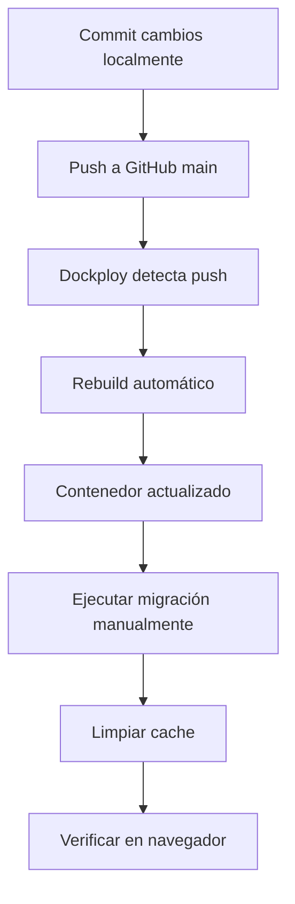

# Despliegue en Dockploy - Card "Pagos Pendientes del Mes"

## 🐳 Contexto

El proyecto está alojado en **Dockploy** con despliegue automático desde GitHub (rama `main`). Esto significa que:

1. Cada `git push` a `main` dispara un rebuild automático
2. La aplicación corre dentro de contenedores Docker
3. Las migraciones deben ejecutarse **dentro del contenedor**

---

## 📋 Pasos para Desplegar

### 1. Commit y Push de los Cambios

```bash
cd /Users/dario.mata/Documents/Github/diabe-platform

# Agregar todos los archivos nuevos/modificados
git add .

# Commit con mensaje descriptivo
git commit -m "feat: Agregar card de Pagos Pendientes del Mes al dashboard

- Migración para soportar parcialidades en facturas
- Endpoint API /api/v1/dashboard/pending_payments
- Componente React PendingPayments integrado en dashboard
- Traducciones en español
- Documentación completa"

# Push a la rama main
git push origin main
```

### 2. Esperar el Despliegue Automático

Dockploy detectará el push y comenzará el rebuild automáticamente. Puedes monitorear el progreso en:
- Dashboard de Dockploy
- Logs del deployment

---

## 🔧 Ejecutar la Migración en el Contenedor

Una vez que el despliegue automático haya terminado, necesitas ejecutar la migración dentro del contenedor.

### Opción A: Desde la Interfaz de Dockploy

Si Dockploy tiene una consola/terminal integrada:

1. Accede al dashboard de Dockploy
2. Selecciona tu proyecto/servicio
3. Abre la terminal/consola del contenedor
4. Ejecuta:
   ```bash
   php artisan migrate
   ```

### Opción B: Vía SSH al Servidor

Si tienes acceso SSH al servidor donde corre Dockploy:

```bash
# Conectar al servidor
ssh usuario@tu-servidor.com

# Listar contenedores en ejecución
docker ps

# Buscar el contenedor de tu aplicación (ejemplo: diabe-platform)
# El nombre puede ser algo como: dockploy-diabe-platform-1

# Ejecutar la migración dentro del contenedor
docker exec -it <nombre-del-contenedor> php artisan migrate

# Ejemplo:
docker exec -it dockploy-diabe-platform-1 php artisan migrate
```

### Opción C: Usando docker-compose

Si Dockploy usa docker-compose:

```bash
# Desde el directorio del proyecto en el servidor
cd /ruta/al/proyecto

# Ejecutar migración
docker-compose exec app php artisan migrate

# O si el servicio se llama diferente:
docker-compose exec web php artisan migrate
```

---

## 🔍 Verificar que la Migración se Ejecutó

Dentro del contenedor, verifica el estado de las migraciones:

```bash
docker exec -it <nombre-del-contenedor> php artisan migrate:status
```

Deberías ver la migración `2026_03_23_000001_add_payment_installments_to_invoices` con estado **Ran**.

---

## 📦 Archivos que se Desplegaron

### Backend
- `database/migrations/2026_03_23_000001_add_payment_installments_to_invoices.php`
- `app/Http/Controllers/DashboardController.php`
- `routes/api.php` (modificado)
- `lang/es_ES.json` (modificado)

### Frontend (build-admin)
- `public/build-admin/react/Dashboard-*.js` (actualizado)
- `public/build-admin/react/PendingPayments-*.js` (nuevo)
- Otros archivos del build React

---

## ⚠️ Consideraciones Importantes

### 1. Persistencia de Datos

Asegúrate de que la base de datos esté en un volumen persistente de Docker. Si el contenedor se recrea, los datos deben mantenerse.

Verifica en tu `docker-compose.yml` o configuración de Dockploy:
```yaml
volumes:
  - db_data:/var/lib/mysql  # o PostgreSQL
```

### 2. Migraciones Automáticas (Opcional)

Puedes configurar que las migraciones se ejecuten automáticamente en cada despliegue agregando al `Dockerfile` o script de inicio:

**Opción 1: En el Dockerfile**
```dockerfile
# Al final del Dockerfile
CMD php artisan migrate --force && php-fpm
```

**Opción 2: Script de inicio**
```bash
#!/bin/bash
# start.sh
php artisan migrate --force
php-fpm
```

⚠️ **Precaución:** Las migraciones automáticas pueden ser peligrosas en producción. Solo úsalas si:
- Tienes backups automáticos
- Las migraciones son reversibles
- Tienes un proceso de rollback definido

### 3. Cache de Configuración

Después de la migración, limpia el cache de Laravel:

```bash
docker exec -it <nombre-del-contenedor> php artisan config:clear
docker exec -it <nombre-del-contenedor> php artisan cache:clear
docker exec -it <nombre-del-contenedor> php artisan route:clear
```

---

## 🧪 Crear Datos de Prueba

Una vez ejecutada la migración, puedes crear facturas de prueba con parcialidades.

### Desde el Contenedor

```bash
# Acceder a Tinker dentro del contenedor
docker exec -it <nombre-del-contenedor> php artisan tinker
```

Luego ejecuta:
```php
// Obtener una factura existente
$invoice = App\Models\Invoice::first();

// Configurar parcialidades
$invoice->installment_count = 12;
$invoice->installment_period = 'monthly';
$invoice->installment_schedule = [
    ['number' => 1, 'due_date' => '2026-01-15', 'amount' => 12000.00],
    ['number' => 2, 'due_date' => '2026-02-15', 'amount' => 12000.00],
    ['number' => 3, 'due_date' => '2026-03-15', 'amount' => 12000.00],
    ['number' => 4, 'due_date' => '2026-04-15', 'amount' => 12000.00],
    ['number' => 5, 'due_date' => '2026-05-15', 'amount' => 12000.00],
    ['number' => 6, 'due_date' => '2026-06-15', 'amount' => 12000.00],
    ['number' => 7, 'due_date' => '2026-07-15', 'amount' => 12000.00],
    ['number' => 8, 'due_date' => '2026-08-15', 'amount' => 12000.00],
    ['number' => 9, 'due_date' => '2026-09-15', 'amount' => 12000.00],
    ['number' => 10, 'due_date' => '2026-10-15', 'amount' => 12000.00],
    ['number' => 11, 'due_date' => '2026-11-15', 'amount' => 12000.00],
    ['number' => 12, 'due_date' => '2026-12-15', 'amount' => 12000.00],
];
$invoice->save();
```

---

## 🔄 Workflow Completo de Despliegue



### Resumen de Comandos

```bash
# 1. Local: Push a GitHub
git add .
git commit -m "feat: Card de pagos pendientes"
git push origin main

# 2. Servidor: Esperar despliegue automático (monitorear en Dockploy)

# 3. Servidor: Ejecutar migración
docker exec -it <contenedor> php artisan migrate

# 4. Servidor: Limpiar cache
docker exec -it <contenedor> php artisan config:clear
docker exec -it <contenedor> php artisan cache:clear

# 5. Navegador: Verificar dashboard
# Abrir https://tu-dominio.com/dashboard
```

---

## 🐛 Troubleshooting en Docker

### El contenedor no arranca después del push

```bash
# Ver logs del contenedor
docker logs <nombre-del-contenedor>

# Ver logs en tiempo real
docker logs -f <nombre-del-contenedor>
```

### Error de permisos en storage/logs

```bash
# Dentro del contenedor
docker exec -it <contenedor> chmod -R 775 storage
docker exec -it <contenedor> chown -R www-data:www-data storage
```

### La migración falla

```bash
# Verificar conexión a la base de datos
docker exec -it <contenedor> php artisan tinker
>>> DB::connection()->getPdo();

# Rollback si es necesario
docker exec -it <contenedor> php artisan migrate:rollback --step=1
```

### La card no aparece en el dashboard

1. Verificar que los archivos del build estén en el contenedor:
   ```bash
   docker exec -it <contenedor> ls -la public/build-admin/react/
   ```

2. Limpiar cache del navegador (Cmd+Shift+R)

3. Verificar que el endpoint responda:
   ```bash
   docker exec -it <contenedor> curl http://localhost/api/v1/dashboard/pending_payments
   ```

---

## 📚 Referencias

- [Documentación de Dockploy](https://dockploy.com/docs)
- [Laravel en Docker](https://laravel.com/docs/deployment#docker)
- [Docker Exec Reference](https://docs.docker.com/engine/reference/commandline/exec/)

---

**Fecha:** 23 de marzo de 2026  
**Plataforma:** Dockploy + Docker  
**Estado:** ✅ Listo para desplegar
